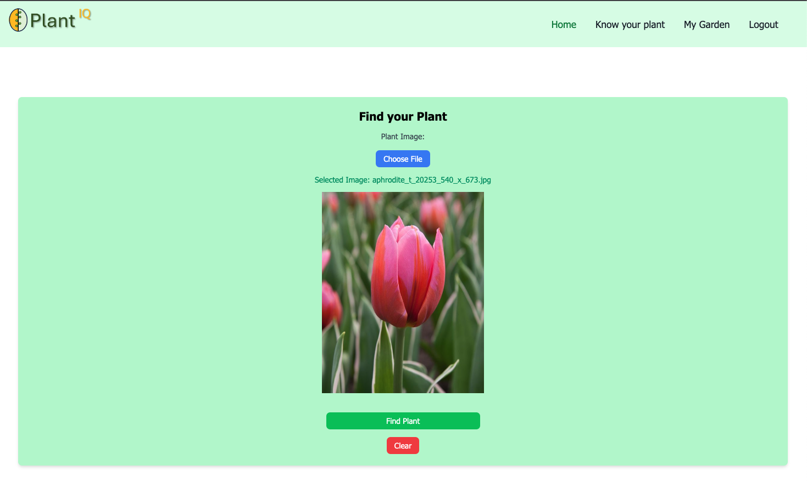
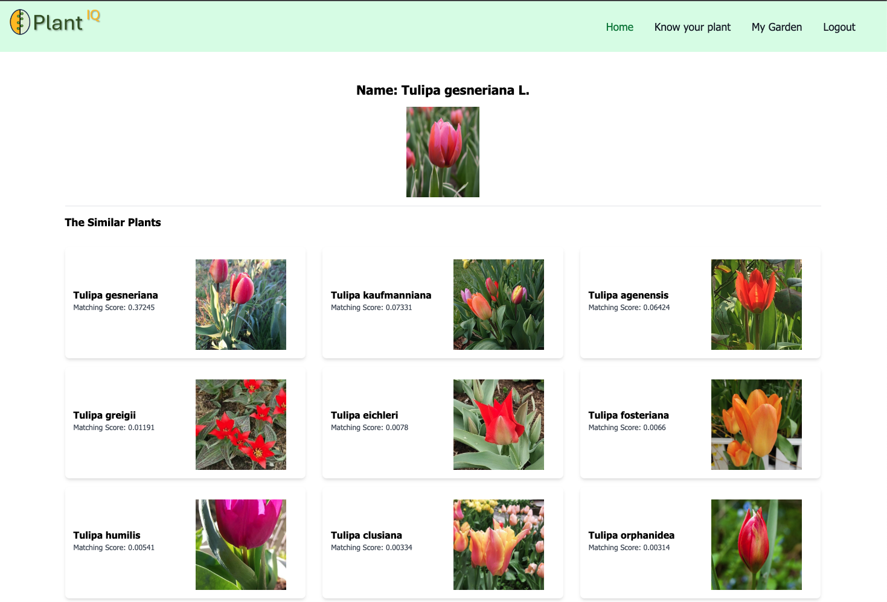
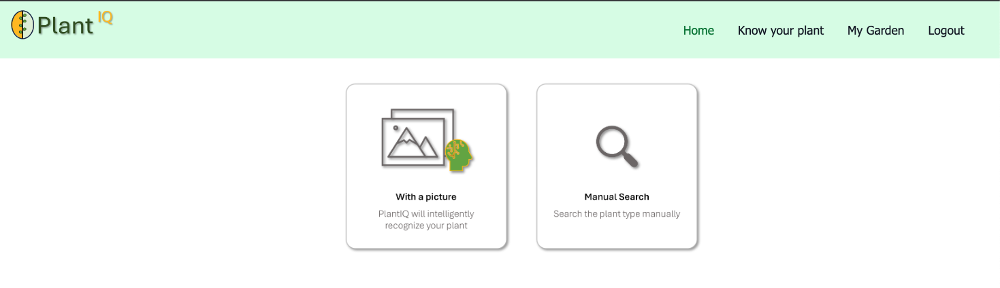
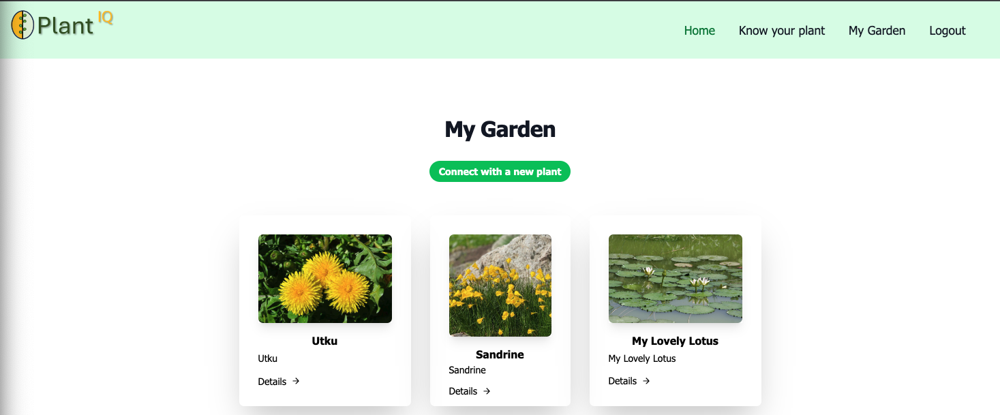
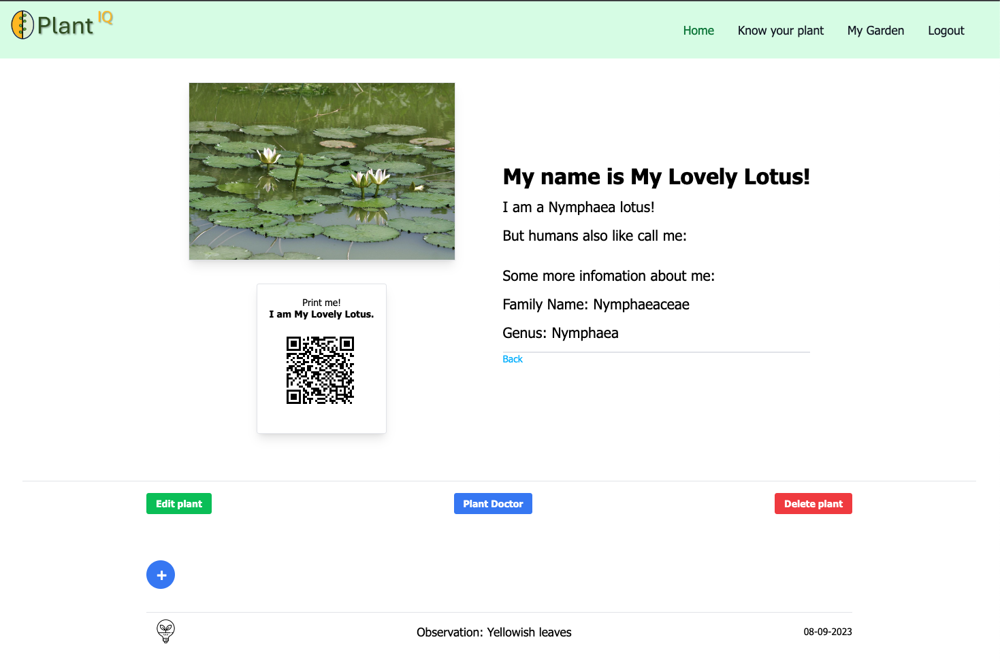
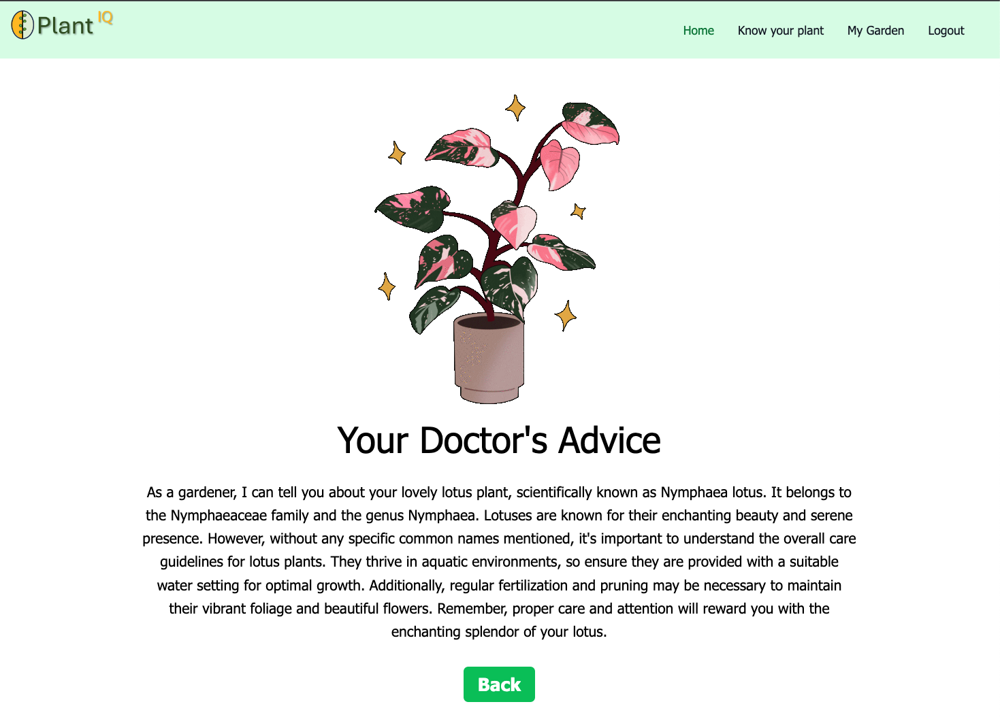

# PlantIQ

Welcome to PlantIQ! This is an web app for smart care of your plants.

## Instructions to Run PlantIQ App in Your Computer

    - Fork or clone this repository
    - Open it with your favorite code editor (i.e. Visual Code)
    - Open the Terminal
    - Run npm install
    - Run npm run dev to start your local server
    - Open the local host in your favorite browser

## API

    - Create a '.env' file in the project folder, and copy paste and replace respectively all the API values
    - PORT=3000
    - SESSION_SECRET= **replace with anything you like**
    - MY_PLANT_KEY= **replace with trefle.io API key**
    - PLANT_NET_API= **replace with plantnet.org API key**
    - CLOUDINARY_NAME= **replace with Cloudinary API name**
    - CLOUDINARY_KEY= **replace with Cloudinary API key**
    - CLOUDINARY_SECRET= **replace with Cloudinary API secret**
    - OPENAI_API_KEY=**replace with OpenAI API key**

## Demo

https://plantiq.adaptable.app/

## Introduction

PlantIQ is a web app developed using Node.js, Express.js, Tailwind, OpenAI API, Plantnet API, Trefle API. It is designed to care your plants in a smart way.

## Features

    - You can discover any plants and their information by search button.
    - You can find any plants on nature or at home with image recognation AI (Know Your Plant section).
    - You can create, read, update or delete your plants from your garden.
    - You can create your own garden with manual search or image recognation after you login.
    - You can add any observation to your plants (any abnormality for example).
    - PlantIQ is also a doctor for your plants. You can learn about your plants and how to fix abnormalities to have healthy plants (Plant Doctor button).
    - You can print the unique QR Code for every plant and reach them easier when you want.

## Instructions to Use PlantIQ

### Know Your Plant Section

<table>
  <tr>
    <td></td>
    <td></td>
  </tr>
</table>
 

### My Garden Section

<table>
  <tr>
    <td></td>
    <td></td>
  </tr>
</table>
 

### Plant Details and Plant Doctor Sections

<table>
  <tr>
    <td></td>
    <td></td>
  </tr>
</table>
